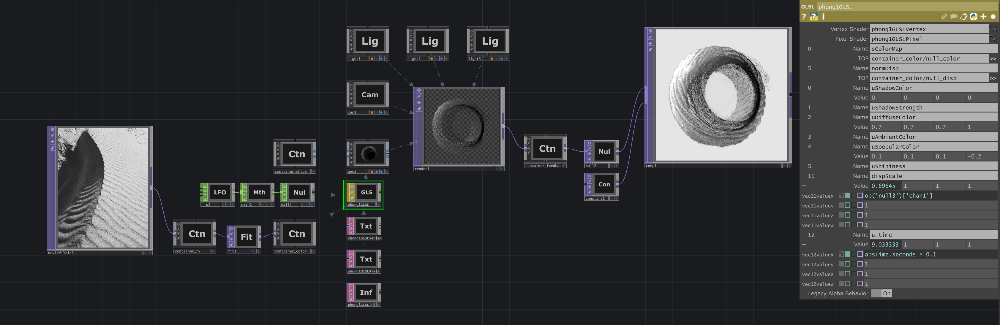

# Generative Particle System

A TouchDesigner project that evolves a static GLSL vertex displacement shader into a fully dynamic, animated visual system.

This project builds upon the foundational techniques of the [GLSL Vertex Displacement](https://github.com/steven-tbd/Touchdesigner-GLSL-vertex-displacement) project by introducing particle rendering, procedural motion, and complex texture processing to create a living, breathing piece of generative art.

This work was recognized and reposted by the official TouchDesigner Instagram account.

## How It Works

This system uses the same core GLSL material from the previous project but builds a more complex generative engine around it.

1.  **Particle Rendering:** The base 3D geometry (e.g., a sphere) is converted into a particle system using a `Convert SOP`, allowing for a more intricate and granular visual style.
2.  **Texture Pre-Processing:** Before the source texture is used to displace the particles, it is processed by a switchable effects module that includes a complex feedback loop, a radial blur, and a light tunnel effect. This allows the history of the texture's state to continually influence the particle system's form.
3.  **Procedural Animation:** A Low-Frequency Oscillator (LFO) is used to drive the `dispScale` uniform of the GLSL shader, creating a natural, pulsing animation without manual keyframing.
4.  **Post-Processing:** A final feedback loop is applied to the rendered output to create additional temporal blurring and visual echoes.

## Usage

Open the `.toe` file in TouchDesigner. The animation is procedural and will run automatically. You can swap out the image using the media_input `Movie File In Top`. You can explore the `container_fx` component to switch between different texture pre-processing effects.

---

### Project Links & Demos

*   **Project Write-up:** [https://stevenmbenton.com/generative-particle-system/](https://https://stevenmbenton.com/generative-particle-system//)
